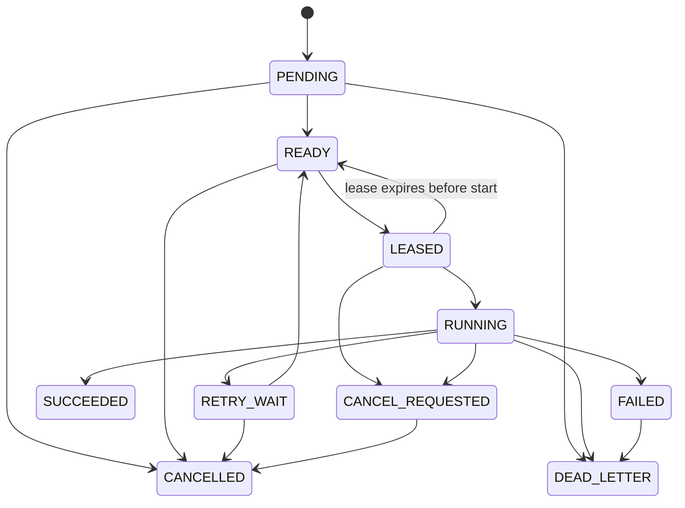

<!--
Flaha Agri Tech
Precision Agriculture Division
Copyright © 2026–2027 Flaha Agri Tech. All rights reserved.

Title: Phase 3G Durable Ingestion Jobs
Introduction:
Documents the PostgreSQL-backed ingestion control plane, its invariants, and its Phase 3H boundary.

Created by: Rafat Al Khashan
Created date: 2026-07-16
Last modified: 2026-07-16
-->

# Phase 3G durable ingestion jobs

## Scope and authority

Phase 3G adds the durable job engine only. TypeScript creates jobs, selects providers through Phase 3F, validates lifecycle changes and provider envelopes, owns retries, fallback choice, cancellation, leases and recovery, and is the sole PostgreSQL writer. Providers execute one bounded attempt and receive neither database authority nor retry, fallback, state-change, or claim authority.

There are no public routes, UI changes, schedulers, brokers, distributed workers, production provider registration, or live Scrapy, Playwright, Docling, Tika, pandas, Python, or Java execution. Phase 3H may consume this service for acquisition workflows.

## Durable model

`IngestionJob` is the optimistic-concurrency aggregate (`version`) and holds its immutable request, selection, policy and limit snapshots. `IngestionAttempt` records exactly one governed provider execution and persists only a SHA-256 lease-token hash. `IngestionJobTransition` is append-only. `IngestionArtifactLink` stores canonical artifact identity plus verification metadata, never artifact contents. `IngestionProvenance` stores one normalized successful-attempt record.

All lifecycle operations that touch multiple records use Prisma transactions. PostgreSQL row locks with `FOR UPDATE SKIP LOCKED` serialize claims and recovery. A partial unique index defines active attempts as `LEASED` or `RUNNING` and permits at most one per job. Application optimistic updates protect stale aggregate writes.

## State machines

`SUCCEEDED`, `CANCELLED`, and `DEAD_LETTER` are terminal. `FAILED` is a recorded non-retryable failure that can only be promoted to dead letter under terminal policy. Attempts move from `LEASED` to `RUNNING`, then to `SUCCEEDED`, `FAILED`, `CANCELLED`, or `LEASE_EXPIRED`; the schema retains additional closed terminal values for timeout and contract rejection.

## Creation, idempotency, and selection

Creation validates the Phase 3F request, requires job type and provider family to match, validates the closed source locator, and computes a canonical SHA-256 fingerprint. The fingerprint excludes request IDs, correlation IDs and timestamps while including job/family/capability, provider preferences, media/language, artifact or governed source, selection requirements, policy and limits. Object keys and language hints are normalized. A database unique constraint arbitrates concurrent idempotency: the same key and fingerprint returns the existing job; a different fingerprint conflicts.

Phase 3F remains the selection authority. The durable selection JSON includes status, selected ID, reason, candidate evaluations, fallback IDs, unavailable reasons, production-authorization input, and a deterministic catalogue/selection hash. A valid request with no eligible provider becomes a durable `DEAD_LETTER` job, preserving the evidence. Arabic or bilingual authoritative document extraction consequently selects no provider.

## Claiming, leases, and heartbeat

Claims are ordered by closed priority, due time, creation time and ID. Future work and terminal/cancelled jobs are excluded. Due `RETRY_WAIT` jobs transition through `READY` in the claim transaction. Claiming creates the numbered attempt, increments `attemptCount`, stores a 256-bit random token only as SHA-256, and returns the raw token once. Token verification uses timing-safe comparison. Heartbeats retain only the latest timestamp and are capped to a one-hour execution window; they do not add high-volume transition rows.

PostgreSQL UTC wall time (`CURRENT_TIMESTAMP AT TIME ZONE 'UTC'`) is authoritative for claim and recovery eligibility because Prisma persists these fields as UTC `timestamp(3)` values without a zone. Application time produces bounded lease deadlines and lifecycle timestamps; normalized database comparisons prevent worker clock skew and the PostgreSQL session time zone from deciding expiry.

## Retry, fallback, cancellation, and recovery

Retry policy is deterministic: exponential delay starts at one second, adds hash-derived bounded jitter, and caps at five minutes. Security violations, artifact mismatch, unsupported language, contract violations, and filesystem/network policy violations never retry. Fallback is selected only from the persisted Phase 3F compatible chain. Attempts cannot exceed `maxAttempts`.

Pending, ready, and retry-wait cancellation is immediate. Leased or running work receives durable `CANCEL_REQUESTED`, which the token-holding worker acknowledges. Cancellation is idempotent and bars later claims and retries. Recovery locks expired attempts in bounded batches. A never-started lease returns to `READY`; a recoverable running lease enters `RETRY_WAIT`; exhausted work dead-letters; cancellation remains cancellation.

## Completion, failure, artifacts, and provenance

Completion revalidates the Phase 3F result against the persisted request, selected provider/version, execution identity, capability, policy, artifact contract and output limits. Artifact links, provenance, attempt success, job success and transition are one transaction. Failure stores bounded safe details, typed semantics, deterministic retry outcome and transition in one transaction. Raw credentials, tokens, headers, cookies, environment dumps, database URLs, absolute runtime paths and unrestricted diagnostics are prohibited.

## Audit and query boundary

Transitions retain actor type/identity, reason, correlation ID, job, optional attempt, states and timestamp. Heartbeats are represented only by `heartbeatAt`. Narrow reads provide a job, its current attempt, ordered paginated attempts, ordered paginated transitions and bounded claimable summaries. Lease-token hashes are omitted from attempt lists.

## Migration and testing

Migration `20260715235955_add_durable_ingestion_jobs` creates only Phase 3G enums, tables, foreign keys, indexes, checks, the active-attempt partial unique index and the transition append-only trigger. It drops or rewrites no existing object. Foreign keys use `RESTRICT`; nullable transition attempt references use `SET NULL`. Closure testing proved that the original append-only trigger also blocked PostgreSQL's foreign-key nulling update, so corrective migration `20260716002500_allow_transition_attempt_set_null` permits only that exact `attemptId` non-null-to-null update while continuing to reject every other transition update and delete. Application services expose no deletion. Rollback would require deliberately removing durable Phase 3G history and is therefore not automated.

Unit tests cover the complete declared transition matrix, prohibited transitions, deterministic hashes/backoff, exhaustion, security classifications and sensitive diagnostics. PostgreSQL integration validation must use the approved local PostgreSQL database or a separately configured dedicated test database; it must not reset or silently replace existing development data.
